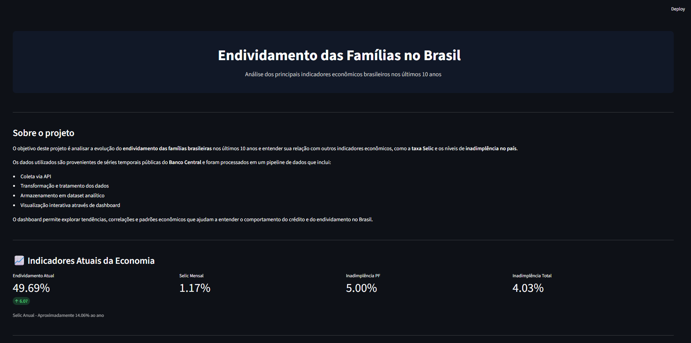
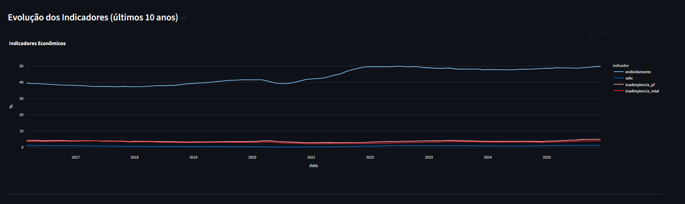
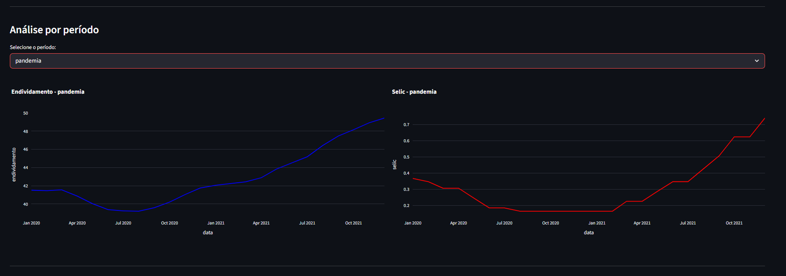
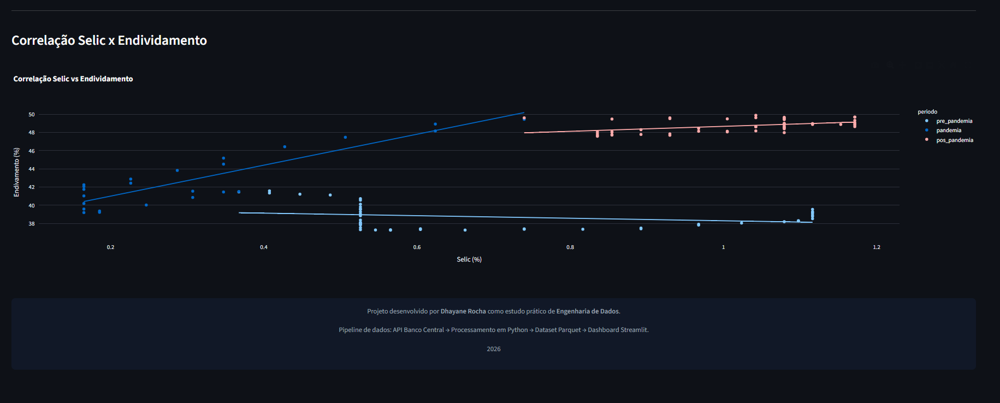

# 📊 Análise do Endividamento das Famílias no Brasil

Projeto de **Engenharia de Dados** desenvolvido para analisar a evolução do endividamento das famílias brasileiras nos últimos 10 anos e sua relação com indicadores econômicos como **taxa Selic** e **inadimplência**.

O projeto implementa um pipeline completo de dados, desde a coleta das séries econômicas até a visualização interativa em um dashboard.

---

# 🎯 Objetivo do Projeto

O objetivo deste projeto é:

- Coletar dados econômicos públicos do Banco Central
- Processar e transformar séries temporais
- Criar um dataset analítico otimizado
- Construir um dashboard interativo para exploração dos dados

A análise permite observar padrões entre **endividamento, inadimplência e taxa de juros** ao longo do tempo.

---

## 📊 Dashboard

O dashboard permite explorar os principais indicadores econômicos relacionados ao endividamento das famílias no Brasil.

### Visão Geral

### Evolução dos Indicadores Econômicos

### Análise por Período

### Correlação Selic x Endividamento

# 🏗 Arquitetura do Projeto

Pipeline de dados:
API Banco Central
↓
Coleta de dados (JSON)
↓
Transformação e limpeza
↓
Dataset analítico (Parquet)
↓
Dashboard interativo (Streamlit)

---
# 📂 Estrutura do projeto: 
ENDIVIDAMENTO-BRASIL/
│
├── config/
│ └── settings.yaml # Configurações do projeto
│
├── data/
│ ├── raw/ # Dados brutos da API
│ ├── clean/ # Dados tratados
│ └── analytics/ # Dataset analítico final
│
├── src/
│ ├── extract/ # Scripts de extração de dados
│ ├── transform/ # Limpeza e transformação
│ ├── analytics/ # Construção do dataset analítico
│ └── dashboard/ # Dashboard Streamlit
│
├── notebooks/
│ └── analysis_exploratorio.ipynb # Análise exploratória dos dados
│
├── main.py # Execução do pipeline
├── requirements.txt # Dependências do projeto
├── README.md
└── venv/

---
# 📊 Indicadores analisados

O projeto utiliza dados econômicos públicos para analisar:

- **Endividamento das famílias**
- **Taxa Selic**
- **Inadimplência de pessoas físicas**
- **Inadimplência total**

Os dados são processados e consolidados em um dataset analítico para facilitar visualizações e análises.

---

# ⚙️ Tecnologias utilizadas

- **Python**
- **Pandas**
- **Streamlit**
- **Plotly**
- **Parquet**
- **Jupyter Notebook**
- **API Banco Central**

---

# 📈 Dashboard

O dashboard permite:

- Visualizar a evolução dos indicadores econômicos
- Filtrar análises por período
- Analisar correlação entre **Selic e endividamento**
- Explorar tendências econômicas dos últimos 10 anos

Para executar o dashboard: 

streamlit run src/dashboard/dashboard.py
---

# 🔎 Análise Exploratória

Durante o desenvolvimento foi realizada uma **análise exploratória dos dados (EDA)** para entender o comportamento das séries econômicas.

O notebook utilizado está disponível em:

notebooks/analysis_exploratorio.ipynb

---

# 📚 Aprendizados

Durante o desenvolvimento deste projeto foram aplicados conceitos importantes de engenharia de dados:

- Consumo de APIs
- Processamento de séries temporais
- Criação de pipelines de dados
- Transformação e limpeza de dados
- Construção de datasets analíticos
- Visualização de dados

---

# 👩‍💻 Autora

**Dhayane Rocha**

Projeto desenvolvido como estudo prático de **Engenharia de Dados**.